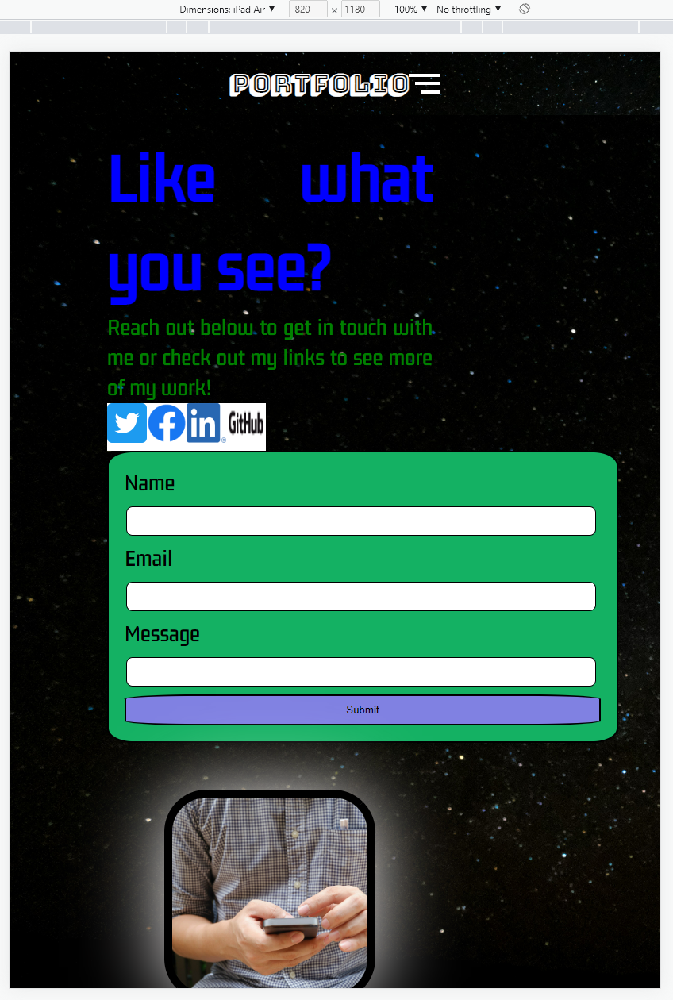

# T1A2 Portfolio - Zachary Coster

Github: https://github.com/ZacharyHC/ZacharyHC.github.io

Deployed Site: https://zacharyhc.github.io/

# Purpose: 

Create a portfolio website to showcase my skills and professional knowledge as web developer and IT professional to potential employers. 

# Target Audience

Potential employers seeking to see live demonstration of my work and demonstrated capablilities. Also any person who may be interested in following along my web dev journey. 

# Functionality / Features 

## Design

All pages utlilise a responsive design with pages linked through use of toggle navigation menu at the top of each page. Hyperlinked text between specific pages (i.e About - Contact) placed within paragraph content as indicated by red font. 

Dark theme with colour used sparingling for text content so as to stand out as main eye-catching content on the page. 

Font chosen for header (Bungee Shade) due to ability to stand out against backdrop and maintain readability during responsive scaling. 

Basic image styling has been used for each image added to the webpage. Images are universally given a box-shadow to provide clear contrast from the page. 

# Sitemap 

## Homepage 
1. 
2. 
3. 

## About Page
1. 
2. 
3. 

## Blog Page
1. 
2. 
3. 

## Contact Page
1. 
2. 
3. 

## Resume Page
1. 
2. 
3. 

# Tech Stack

* HTML
* CSS 
* Github 
* Balsamiq
 